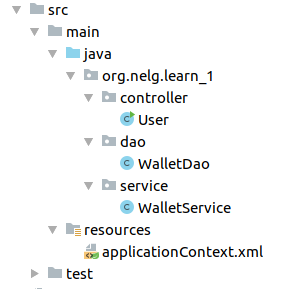
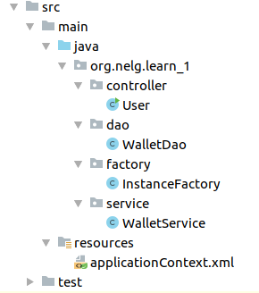

# IOC容器

---

> 在Spring中，有多种方式可以创建使用IOC容器

### XML

- 目录

  

- 创建和使用

  1. 方式一：

     1. 添加`WalletDao.java`文件，添加如下内容：

        ```java
        package org.nelg.learn_1.dao;
        
        public class WalletDao {
        
            public WalletDao() {
                System.out.println("Wallet Dao 对象被创建");
            }
        
            public void getMoney() {
                System.out.println("get Money from dao");
            }
        }
        ```

     2. 添加`WalletService.java`文件，添加如下内容：

        ```java
        package org.nelg.learn_1.service;
        
        import org.nelg.learn_1.dao.WalletDao;
        
        public class WalletService {
        
            protected WalletDao walletDao = new WalletDao();
        
            public WalletService() {
                System.out.println("WalletService对象被创建");
            }
        
            public void getMoney() {
                this.walletDao.getMoney();
                System.out.println("get Money from service");
            }
        }
        ```

     3. 在`resources`中添加配置文件`applicationContext.xml`，将需要`Spring`框架创建的对象配置在其中：

        ```xml
        <?xml version="1.0" encoding="UTF-8"?>
        <beans xmlns="http://www.springframework.org/schema/beans"
               xmlns:xsi="http://www.w3.org/2001/XMLSchema-instance"
               xsi:schemaLocation="http://www.springframework.org/schema/beans
               http://www.springframework.org/schema/beans/spring-beans.xsd">
        
            <bean id="walletService" class="org.nelg.learn_1.service.WalletService"></bean>
            <bean id="walletDao" class="org.nelg.learn_1.dao.WalletDao"></bean>
        </beans>
        ```

     4. 使用，在`User.java`文件中，添加如下内容：

        ```java
        package org.nelg.learn_1.controller;
        
        import org.nelg.learn_1.service.WalletService;
        import org.springframework.context.ApplicationContext;
        import org.springframework.context.support.ClassPathXmlApplicationContext;
        
        public class User {
        
            public static void main(String[] args) {
        
                //获取IOC容器对象
                ApplicationContext ac = new ClassPathXmlApplicationContext("applicationContext.xml");
        
                //更加id获取bean对象
                WalletService walletService = (WalletService) ac.getBean("walletService");
                walletService.getMoney();
            }
        }
        ```

  2. 方式二：

     1. 重复`方式一`的1、2步骤

     2. 添加`factory包`，并添加`InstanceFactory.java`文件

        

        ```java
        package org.nelg.learn_1.factory;
        
        import org.nelg.learn_1.service.WalletService;
        
        public class InstanceFactory {
        
            public WalletService getWalletService() {
                return new WalletService();
            }
        }
        ```

     3. 在`resources`中添加配置文件`applicationContext.xml`，将需要`Spring`框架创建的对象配置在其中：

        ```xml
        <?xml version="1.0" encoding="UTF-8"?>
        <beans xmlns="http://www.springframework.org/schema/beans"
               xmlns:xsi="http://www.w3.org/2001/XMLSchema-instance"
               xsi:schemaLocation="http://www.springframework.org/schema/beans
               http://www.springframework.org/schema/beans/spring-beans.xsd">
        
            <bean id="instanceFactory" class="org.nelg.learn_1.factory.InstanceFactory"></bean>
            <bean id="walletService" factory-bean="instanceFactory" factory-method="getWalletService"></bean>
        </beans>
        ```

     4. 使用，如`方式一`

  3. 方式三：

     1. 重复`方式一`的1、2步骤

     2. 添加`factory包`，并添加`StaticFactory.java`文件

        

        ```java
        package org.nelg.learn_1.factory;
        
        import org.nelg.learn_1.service.WalletService;
        
        public class StaticFactory {
        
            static public WalletService getWalletService() {
                return new WalletService();
            }
        }
        ```

     3. 在`resources`中添加配置文件`applicationContext.xml`，将需要`Spring`框架创建的对象配置在其中：

        ```xml
        <?xml version="1.0" encoding="UTF-8"?>
        <beans xmlns="http://www.springframework.org/schema/beans"
               xmlns:xsi="http://www.w3.org/2001/XMLSchema-instance"
               xsi:schemaLocation="http://www.springframework.org/schema/beans
               http://www.springframework.org/schema/beans/spring-beans.xsd">
        
            <bean id="walletService" class="org.nelg.learn_1.factory.StaticFactory" factory-method="getWalletService"></bean>
        </beans>
        ```

     4. 使用，如`方式一`

