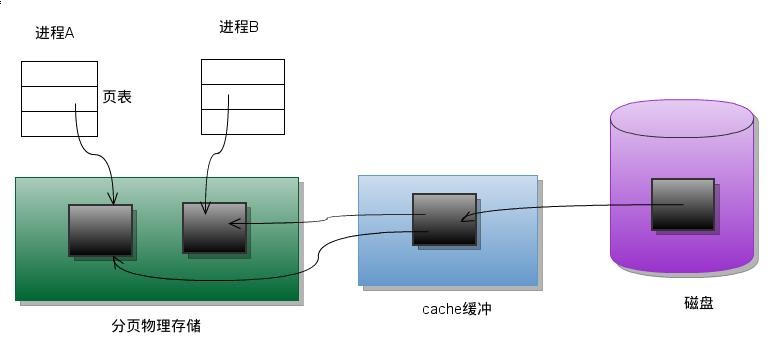
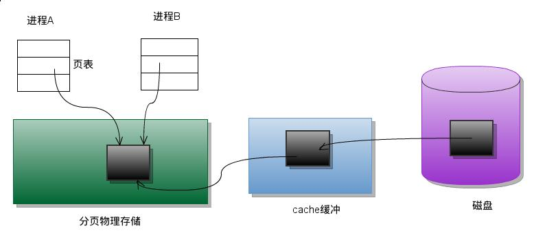

# 共享内存

---

> 共享内存可以说是最有用的进程间通信方式，也是最快的IPC形式, 因为进程可以直接读写内存，而不需要任何数据的拷贝。对于像管道和消息队列等通信方式，则需要在内核和用户空间进行四次的数据拷贝，而共享内存则只拷贝两次数据: 一次从输入文件到共享内存区，另一次从共享内存区到输出文件。实际上，进程之间在共享内存时，并不总是读写少量数据后就解除映射，有新的通信时，再重新建立共享内存区域。而是保持共享区域，直到通信完毕为止，这样，数据内容一直保存在共享内存中，并没有写回文件。共享内存中的内容往往是在解除映射时才写回文件的。因此，采用共享内存的通信方式效率是非常高的。

### 传统文件访问

UNIX访问文件的传统方法是用open打开它们， 如果有多个进程访问同一个文件，则每一个进程在自己的地址空间都包含有该文件的副本,这不必要地浪费了存储空间。下图说明了两个进程同时读一个文件的同一页的情形. 系统要将该页从磁盘读到高速缓冲区中, 每个进程再执行一个存储器内的复制操作将数据从高速缓冲区读到自己的地址空间。

### 共享存储映射

现在考虑另一种处理方法：进程A和进程B都将该页映射到自己的地址空间，当进程A第一次访问该页中的数据时，它生成一个缺页中断。内核此时读入这一页到内存并更新页表使之指向它。以后当进程B访问同一页面而出现缺页中断时，该页已经在内存，内核只需要将进程B的页表登记项指向次页即可。如下图所示：

 

### mmap()及其相关系统调用

`mmap()`系统调用使得进程之间通过映射同一个普通文件实现共享内存。普通文件被映射到进程地址空间后，进程可以向访问普通内存一样对文件进行访问，不必再调用`read()`，`write()`等操作。

### 对mmap()返回地址的访问

`linux`采用的是页式管理机制。对于用`mmap()`映射普通文件来说，进程会在自己的地址空间新增一块空间，空间大 小由`mmap()`的`len`参数指定，注意，进程并不一定能够对全部新增空间都能进行有效访问。进程能够访问的有效地址大小取决于文件被映射部分的大小。简单的说，能够容纳文件被映射部分大小的最少页面个数决定了 进程从`mmap()`返回的地址开始，能够有效访问的地址空间大小。超过这个空间大小，内核会根据超过的严重程度返回发送不同的信号给进程。可用如下图示说明：

