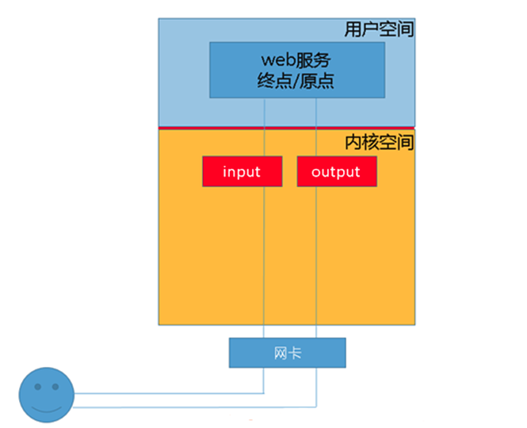
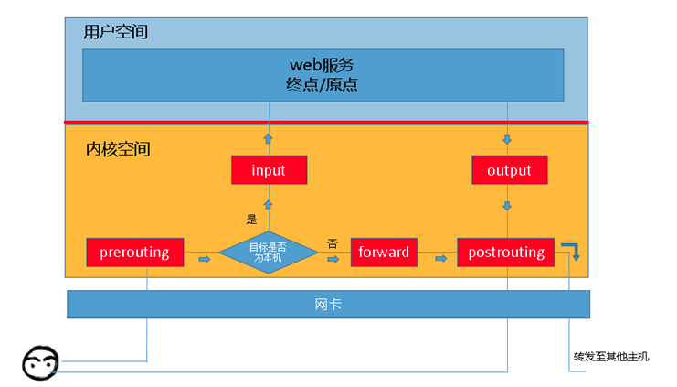
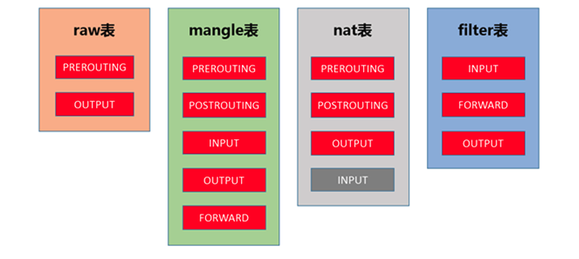

# iptables概念

---

1. ##### 前置概念

   - 从逻辑上讲。防火墙可以大体分为主机防火墙和网络防火墙。

     - `主机防火墙`：针对于单个主机进行防护。
     - `网络防火墙`：往往处于网络入口或边缘，针对于网络入口进行防护，服务于防火墙背后的本地局域网。

     > 网络防火和主机防火墙并不冲突，可以理解为，网络防火墙主外(集体)，主机防火墙主内(个人)。

   - 从物理上讲，防火墙可以分为硬件防火墙和软件防火墙。

     - `硬件防火墙`：在硬件级别实现部分防火墙功能，另一部分功能基于软件实现，性能高，成本高。如：思科ASA 华为防火墙、天融信防火墙等。
     - `软件防火墙`：应用软件处理逻辑运行于通用硬件平台之上的防火墙，性能低，成本低。如：iptables、firewall（centos7独有的）等。

2. ##### `iptables`基础概念

   - `iptables`其实不是真正的防火墙，我们可以把它理解成一个客户端，用户通过`iptables`这个客户端代理，将用户的安全设定执行到对应的安全框架中，这个安全框架才是真正的防火墙，这个框架的名字叫 `netfilter`。`netfilter`才是防火墙真正的安全框架( framework)，`netfilter`位于内核空间

   - `iptables`其实是个命令行工具，位于用户空间，我们用这个工具操作真正的框架。

   - `netfilter/ iptables`(下文中简称为`iptables`)组成 Linux平台下的包过滤防火墙，与大多数的 Linux软件一样，这个包过滤防火墙是兔费的，它可以代替昂贵的商业防火墙解决方案，完成封包过滤、封包重定向和网络地址转换(NAT)等功能。

   - `Netfilter`是 Linux操作系统核心层内部的—一个数据包处理模块，它具有如下功能：

     - 网络地址转换( Network Address Translate)
     - 数据包内容修改
     - 数据包过滤的防火墙功能

     > 所以说，虽然我们使用 service iptables start启动 iptables"服务"，但是其实准确的来说， iptables并没有一个守护进程，所以并不能算是真正意义上的服务，而应该算是内核提供的功能。

3. ##### iptables基础工作原理

   > 我们知道`iptables`是按照规则来办事的，我们就来说说规则(rules)，规则其实就是网络管理员预定义的条件，规则一般的定义为"如果数据包头符合这样的条件，就这样处理 这个数据包”。规则存储在内核空间的信息包过滤表中，这些规则分别指定了源地址、目的地址、传输协议(如TCP、UDP、|CMP)和服务类型(如HTP、FP和SMTP)等。 数据包与规则匹配时， iptables就根据规则所定义的方法来处理这些数据包，如放行( accept)、拒绝(reject))和丢弃(drop)等。配置防火墙的主要工作就是添加、修改 和删除这些规则。

   `iptables`工作流程图

   

   如上图：当客户端（人脸图标）访问服务器的web服务时，客户端发送报文到网卡，而tcp/ip协议栈是属于内核的一部分，所以，客户端的信息会通过内核的TCP协议传输到用户空间中的web服务 中，而此时，客户端报文的目标终点为web服务所监听的套接字(P：Por)上，当web服务需要响应客户端请求时，web服务发出的响应报文的目标终点则为客户端，这个时候，web服务所监听的端囗反而变成了原点，我们说过， `netfilter`才是真正的防火墙，它是内核的部分，所以，如果我们想要防火墙能够达到"防火"的目的，则需要在内核中设置关卡，所有进出的报文都要通过这些关卡，经过检查后，符合放行条件的才能放行，符合阻拦条件的则需要被阻止，于是，就出现了input关卡和 output关卡，而这些 关卡在 iptables中不被称为关卡"而被称为链"。

   其实我们上面描述的场景并不完善，因为客户端发来的报文访问的目标地址可能并不是本机，而是其他服务器，当本机的内核支持`IP FORWARD`（IP转发/重定向）时，我们可以将报文转发给其他服务器，所以，这个时候我们就会提到`iptables`中的其他"关卡"，也就是其他"链"，他们就是"路由前"、"转发"、"路由后"，他们的英文名是`PREROUTING`、`FORWARD`、`POSTROUTING`也就是说，当我们启用了防火墙功能时，报文需要经过如下关卡，也就是说，根据实际情况的不同，报文经过链可能不同。如果报文需要转发，那么报文则不会经过`INPUT`链 发往用户空间，而是直接在内核空间中经过`FORWARD`链和 `POSTROUTING`链转发出去的，如下图：

   

   所以，根据上图，我们能够想象出某些常用场景中，报文的流向

   ​	到本机某进程的报文：PREROUTING->INPUT

   ​	由本机转发的报文： PREROUTING-> FORWARD-> POSTROUTING

   ​	由本机的某进程发出报文(通常为响应报文)： OUTPUT-> POSTROUTING

4. ##### 规则表

   1. 表的概念

      我们再想想另外一个问题，我们对每个"链”上都放置了一串规则，但是这些规则有些很相似，比如，A类规则都是对ip或者端囗的过滤，B类规则是修改报文，那么这个时候，我们是不是能把实现相同功能的规则放在一起呢，必须能的！我们把具有相同功能的规则的集合叫做"表"，所以说，不同功能的规则，我们可以放置在不同的表中进行管理，而`iptables`已经为我们定义了4种表，每种表对应了不同的功能，而我们定义的规则也都逃脫不了这4种功能的范围，所以，学习 `iptables`之前我们必须先搞明白每种表的作用。

   2. `iptables`为我们提供了如下规则的分类，或者说，`iptables`为我们提供了如下"表"：

      1. filter表：负责过滤功能，防火墙；内核模块：iptables_filter

      2. nat表： network address translation，网络地址转换功能；内核模块：iptables_nat

      3. mangle表：拆解报文，做出修改，并重新封装的功能；iptables_mangle

      4. raw表：关闭nat表上启用的连接追踪机制；iptables_raw

         > 也就是说，我们自定义的所有规则，都是这四种分类中的规则，或者说，所有规则都存在于这4张表中。

   3. 表链关系

      

      由上图可知每条链可存在哪个规则表中，以及每个表有优先级，如`PREROUTING`链为例：

      1. `PREROUTING`链可存在`raw`、`mangle`、`nat`三个表中
      2. 规则执行顺序则是以`raw`->`mangle`->`nat`的顺序执行

   4. 链的规则存放于哪些表中(从链到表的对应关系)

      1. REROUTING的规则可以存在于：raw表，mangle表，nat表。
      2. INPUT的规则可以存在于：mangle表，filter表，(centos7中还有nat表， centos6中没有)。
      3. FORWARD的规则可以存在于：mangle表，filter表。
      4. OUTPUT的规则可以存在于：raw表，mangle表，nat表，filter表。
      5. POSTROUTING的规则可以存在于：mangle表，nat表。

   5. 表中的规则可以被哪些链使用(从表到链的对应关系)

      1. raw表中的规则可以被哪些链使用：PREROUTING，OUTPUT
      2. mangle表中的规则可以被哪些链使用：PREROUTING，INPUT，FORWARD，OUTPUT，POSTROUTING
      3. nat表中的规则可以被哪些链使用：PREROUTING，OUTPUT，POSTROUTING(centos7中还有INPUT，centos6中没有)
      4. filter表中的规则可以被哪些链使用：INPUT，FORWARD，OUTPUT

   